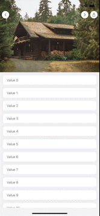

# React Native Animated Header ScrollView

[![NPM version][npm-image]][npm-url] [![npm][npm-downloads]][npm-url] [![npm][license-url]][npm-url] [![npm][types-url]][npm-url] [![runs with expo][expo-image]][expo-url]

Performant animated scroll view components that:
* 🔥Support `FlatList` and `ScrollView` scrolling interactions.
* 🔥Animate an image or a custom component into a navbar header
* 🔥Support bounce animation on scroll down
* 🔥Support both iOS and Android devices




# Installation
```sh
$ npm install @kanelloc/react-native-animated-header-scroll-view
```

# Usage
```typescript
import { Card, TopNavBar, HeaderNavBar } from '../components';
import { AnimatedScrollView } from '@kanelloc/react-native-animated-header-scroll-view';
import * as React from 'react';

export const App = () => {
  const data = Array.from(Array(20).keys());
  return (
    <AnimatedScrollView
      HeaderNavbarComponent={<HeaderNavBar />}
      TopNavBarComponent={<TopNavBar />}
      headerImage={require('../../assets/cabin.jpg')}
    >
      {data.map((e) => {
        return <Card item={e} key={e} />;
      })}
    </AnimatedScrollView>
  );
};
```

```typescript
import { Card, TopNavBar, HeaderNavBar } from '../components';
import { AnimatedScrollView } from '@kanelloc/react-native-animated-header-scroll-view';
import * as React from 'react';

export const App = () => {
  const data = Array.from(Array(20).keys());
  const renderItem = ({ item }: any) => {
    return (
      <View>
        <Card item={item} />
      </View>
    );
  };

  return (
    <AnimatedFlatList
      headerImage={require('../../assets/cabin.jpg')}
      data={data}
      renderItem={renderItem}
      HeaderNavbarComponent={<HeaderNavBar />}
      TopNavBarComponent={<TopNavBar />}
    />
  );
};
```

You can find a set of detailed examples [here](https://github.com/kanelloc/react-native-animated-header-scroll-view/tree/main/example)

Also a running snack [here](https://snack.expo.dev/ukGomwbdE)

# Props

| Prop name                | Description                                                                                                                 | Type                  | Required |
|--------------------------|-----------------------------------------------------------------------------------------------------------------------------|-----------------------|----------|
| `TopNavBarComponent`     | Rendered on top of the screen as a navbar when scrolling to the top                                                         | JSX.Element           | true     |
| `HeaderComponent`        | A component to use on top of header image. It can also be used without header image to render a custom component as header. | JSX.Element           | false    |
| `HeaderNavbarComponent`  | Rendered on top of the header. Transitions to TopNavbarComponent as you scroll                                              | JSX.Element           | false    |
| `headerMaxHeight`        | Height of the header (headerImage or HeaderComponent). Default value is 300                                                 | number                | false    |
| `topBarHeight`           | Height of the top navbar. Default value is 90                                                                               | number                | false    |
| `headerImage`            | Image header source                                                                                                         | ImageSourcePropType   | false    |
| `disableScale`           | Disables header scaling when scrolling. Default value is false                                                              | boolean               | false    |
| `imageStyle`             | Image styles                                                                                                                | StyleProp<ImageStyle> | false    |


# Contributing

See the [contributing guide](CONTRIBUTING.md) to learn how to contribute to the repository and the development workflow.

# License

MIT

[npm-url]: https://www.npmjs.com/package/@kanelloc/react-native-animated-header-scroll-view
[npm-image]: https://img.shields.io/npm/v/@kanelloc/react-native-animated-header-scroll-view?style=flat-square
[license-url]: https://img.shields.io/npm/l/@kanelloc/react-native-animated-header-scroll-view?style=flat-square
[types-url]: https://img.shields.io/badge/types-included-blue?style=flat-square
[expo-image]: https://img.shields.io/badge/Runs%20with%20Expo-4630EB.svg?style=flat-square&logo=EXPO&labelColor=f3f3f3&logoColor=000
[expo-url]: https://expo.io
[npm-downloads]: https://img.shields.io/npm/dm/@kanelloc/react-native-animated-header-scroll-view?style=flat-square
